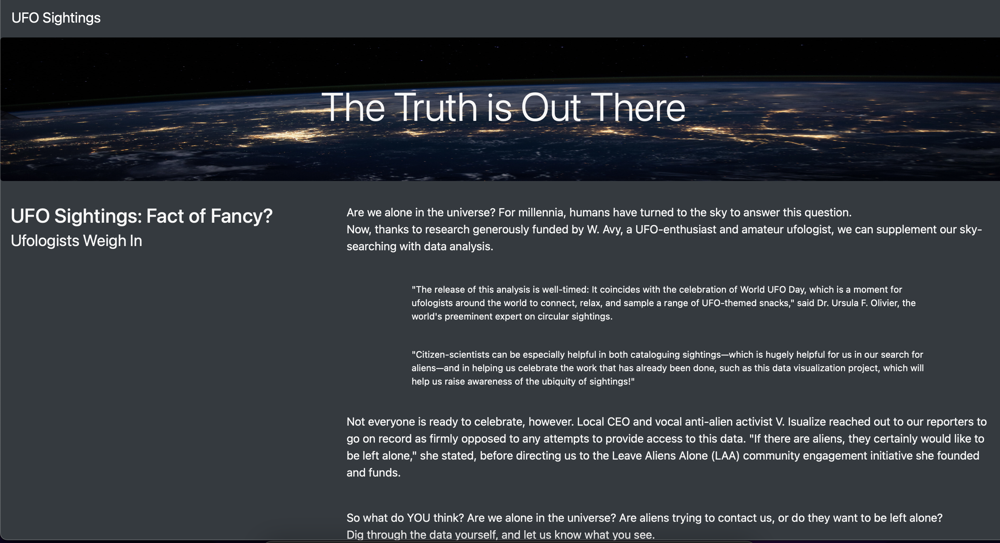
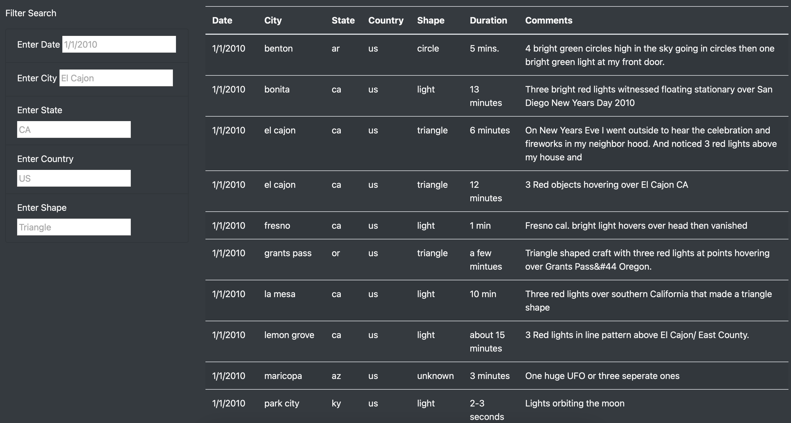

# UFOs

UFOs Sightings with JS

## Overview of Project 

Display a table showing UFO data within a JavaScript array. This website visualization has to have filters of differents criterias so the website will be very dynamic. In order to create and formatting this website I had to use JavaScript with HTML/CSS and Bootstrap.

## Results 

* Main look at the website 

* Filters 

## Summary 

This created website contains a lot of information and you can look through many differents filters but one thing that could be improved is the case sensitive in those filters. This is a recommendation

